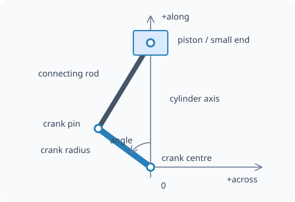

Slider-cranks
=============

A planar slider-crank turns a crank rotation into piston motion through
a connecting rod. These helpers calculate the crank pin, rod tilt and
small-end height from one crank angle. Import from ``machinome_mechanics``
or ``machinome_mechanics.cranks``.

.. py:currentmodule:: machinome_mechanics

Frame and zero
--------------

The coordinates are ``(across, along)`` in the crank plane. The cylinder
axis is the along axis, passing through the crank centre. Zero crank
angle is top dead centre: the crank pin points along the positive
cylinder axis. A positive angle carries the pin toward **negative across**.

   The connecting rod brings the small end back to the cylinder axis.
   The sketch shows the coordinate convention, not particular dimensions.

A V8 engine model, for example, uses ``across = y`` and ``along = z``,
with the crank rotating about +X. Map the plane into your machine's frame yourself;
bank angles and throw phases become offsets to the angle you pass in.

crank_pin
---------

.. py:function:: crank_pin(angle, crank_radius)

   Return the pin position relative to the crank centre.

   :param angle: Crank angle in degrees, measured from top dead centre.
   :param crank_radius: Distance from the crank centre to the pin.
   :returns: ``(-crank_radius * sin(angle), crank_radius * cos(angle))``
             as an ``(across, along)`` tuple, in the radius's length unit.
             Each component may be numeric or symbolic.

.. doctest::

   >>> from machinome_mechanics import crank_pin
   >>> tuple(round(v, 6) for v in crank_pin(0, 15))
   (-0.0, 15.0)
   >>> tuple(round(v, 6) for v in crank_pin(90, 15))
   (-15.0, 0.0)

crank_rod_angle
---------------

.. py:function:: crank_rod_angle(angle, crank_radius, rod_length)

   Return the connecting rod's tilt from the cylinder axis.

   :param angle: Crank angle in degrees, measured from top dead centre.
   :param crank_radius: Crank-centre to pin distance.
   :param rod_length: Positive distance between the connecting rod's joints,
                      in the same unit as ``crank_radius``.
   :returns: ``-asin((crank_radius / rod_length) * sin(angle))`` degrees,
             as a number or symbolic expression.

Author the rod along the positive cylinder axis from its big end at the
pin. Rotate it by this angle in the same rotational sense as the crank,
then place that end at :py:func:`crank_pin`. The **negative** arcsine
makes the small end land on the cylinder axis.

.. doctest::

   >>> from machinome_mechanics import crank_rod_angle
   >>> round(crank_rod_angle(90, 15, 60), 4)
   -14.4775

piston_height
-------------

.. py:function:: piston_height(angle, crank_radius, rod_length)

   Return the small end's along coordinate relative to the crank centre.

   :param angle: Crank angle in degrees, measured from top dead centre.
   :param crank_radius: Crank-centre to pin distance.
   :param rod_length: Distance between the connecting rod's joints,
                      in the same unit as ``crank_radius``.
   :returns: ``crank_radius * cos(angle) + sqrt(rod_length**2 -
             (crank_radius * sin(angle))**2)`` in the supplied length unit,
             as a number or symbolic expression.

This is a position, not the distance travelled from top dead centre.
To obtain downward travel from top dead centre, subtract the result
from ``crank_radius + rod_length``. The positive square root selects the
small end on the positive-along side of the crank pin.

.. doctest::

   >>> from machinome_mechanics import piston_height
   >>> [round(piston_height(a, 15, 60), 4) for a in (0, 90, 180)]
   [75.0, 58.0948, 45.0]
   >>> 15 + 60 - piston_height(180, 15, 60)
   30.0

The 30 mm stroke is twice the crank radius. At a quarter turn, the rod's
obliquity makes piston motion differ from a simple cosine.

Valid geometry
--------------

Use nonnegative crank radius and positive rod length. At any sampled
angle, ``abs(crank_radius * sin(angle))`` must not exceed ``rod_length``.
A rod longer than the crank radius permits a full rotation without the
collapsed configuration of equal lengths. A zero rod length makes the
rod-angle calculation divide by zero. Unreachable angles cause the
underlying inverse sine or square root to fail numerically.

These functions describe an in-line cylinder with no lateral offset.
See :doc:`../using-with-machinome` for a complete piston motion law.
