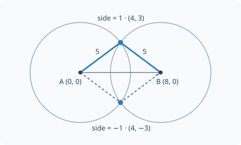

Planar linkages
===============

Find a point where two fixed-length links meet, calculate an angle from
three side lengths, or find a link's vertical rise. Import from
``machinome_mechanics`` or ``machinome_mechanics.linkages``.

.. py:currentmodule:: machinome_mechanics

Coordinates are ``(x, y)`` in your chosen plane, with consistent length
units. Angles are degrees. Map the resulting point into your machine's
frame after the calculation.

circle_intersection
-------------------

.. py:function:: circle_intersection(centre_a, radius_a, centre_b, radius_b, side=1)

   Return the selected intersection of two circles.

   :param centre_a: First centre as an ``(x, y)`` tuple.
   :param radius_a: First radius, or link length from the first centre.
   :param centre_b: Second centre as an ``(x, y)`` tuple.
   :param radius_b: Second radius, in the same unit as the coordinates.
   :param side: ``1`` selects the intersection to the left of the direction
                from ``centre_a`` to ``centre_b``; ``-1`` selects the right.
   :returns: An ``(x, y)`` tuple at the requested distance from both
             centres. Components may be numeric or symbolic.

The two intersections are two possible assembly branches. Select the
one your machine uses, keeping the order of the centres consistent.
In standard XY coordinates, left of an A-to-B direction along +X is +Y:

   ``side`` selects a branch relative to A → B.

.. doctest::

   >>> from machinome_mechanics import circle_intersection
   >>> circle_intersection((0, 0), 5, (8, 0), 5)
   (4.0, 3.0)
   >>> circle_intersection((0, 0), 5, (8, 0), 5, side=-1)
   (4.0, -3.0)
   >>> circle_intersection((1, 1), 5, (1, 9), 5, side=1)
   (-2.0, 5.0)

For example, the grasshopper escapement in 3DPrintedClocks finds its nib
as the intersection of a circle about the origin and one about a moving
pivot:

.. doctest::

   >>> nib = circle_intersection((0, 0), 45, (30, 40), 20, side=1)
   >>> tuple(round(v, 4) for v in nib)
   (10.3625, 43.7906)

For centre distance ``d`` and nonnegative radii, a reachable intersection
requires ``abs(radius_a - radius_b) <= d <= radius_a + radius_b`` and
``d > 0``. Tangency gives the same point for either side. Coincident
centres divide by zero; disjoint or strictly nested circles have no
intersection and cause a numeric square-root domain error. ``side``
is not validated: pass exactly ``1`` or ``-1``. Other values generally
do not return a point on both circles.

triangle_angle
--------------

.. py:function:: triangle_angle(opposite, adjacent_a, adjacent_b)

   Return the angle between the two adjacent sides of a triangle.

   :param opposite: Length of the side opposite the requested angle.
   :param adjacent_a: Positive length of one side meeting at the angle.
   :param adjacent_b: Positive length of the other side meeting there.
   :returns: ``acos((adjacent_a**2 + adjacent_b**2 - opposite**2) /
             (2 * adjacent_a * adjacent_b))`` in degrees, as a number or
             symbolic expression.

This is the unsigned interior angle, in the range 0–180 degrees for
valid input; your project chooses the sign when using it as a rotation.

.. doctest::

   >>> from machinome_mechanics import triangle_angle
   >>> triangle_angle(5, 3, 4)
   90.0
   >>> round(triangle_angle(3, 4, 5), 4)
   36.8699

Use side lengths that satisfy the triangle inequality. A zero adjacent
side divides by zero; an impossible triangle puts ``acos`` outside its
domain. Equality in the triangle inequality is a degenerate, straight
configuration.

link_rise
---------

.. py:function:: link_rise(link, offset)

   Return the positive vertical separation of a link's endpoints.

   :param link: Nonnegative rigid-link length.
   :param offset: Horizontal separation of its endpoints, in the same unit.
   :returns: ``sqrt(link**2 - offset**2)`` in the supplied length unit,
             as a number or symbolic expression.

The positive root selects the upper branch. Negate it if your chosen
endpoint is below the other. The sign of the horizontal offset does
not affect the rise.

.. doctest::

   >>> from machinome_mechanics import link_rise
   >>> link_rise(5, 3)
   4.0
   >>> link_rise(5, -3)
   4.0
   >>> link_rise(5, 5)
   0.0

Require ``abs(offset) <= link``. Equality lays the link horizontally;
a greater offset is unreachable. As with the other linkage helpers,
invalid numeric domains raise rather than returning an invented pose.

two_link_angles
---------------

.. py:function:: two_link_angles(x, y, first_length, second_length, side=1)

   Solve a planar two-link reach from a pivot at ``(0, 0)``.

   :param x: Target coordinate along the plane's +X reference direction.
   :param y: Target coordinate along +Y, in the same length unit.
   :param first_length: Positive pivot-to-knee length.
   :param second_length: Positive knee-to-target length.
   :param side: Literal ``1`` for the knee left of pivot-to-target, ``-1``
                for the knee right of it, as with :py:func:`circle_intersection`.
   :returns: ``(shoulder, elbow)`` in degrees, numeric or deferred. Shoulder
             is absolute from +X toward +Y; elbow is relative to the first
             link. The second link's absolute bearing is their sum.

For distance ``d = sqrt(x*x + y*y)``, shoulder is ``atan2(y, x)`` plus
``side * triangle_angle(second_length, first_length, d)``; elbow is
``side * (triangle_angle(d, first_length, second_length) - 180)``.
Positive angles are counterclockwise about +Z in this plane. Side is not
validated or normalized: supply exactly +1 or -1.

.. doctest::

   >>> from machinome_mechanics import two_link_angles
   >>> tuple(round(a, 4) for a in two_link_angles(3, 4, 5, 5))
   (113.1301, -120.0)
   >>> tuple(round(a, 4) for a in two_link_angles(3, 4, 5, 5, side=-1))
   (-6.8699, 120.0)
   >>> two_link_angles(8, 0, 5, 3)
   (0.0, 0.0)
   >>> from math import cos, sin, radians
   >>> shoulder, elbow = map(radians, two_link_angles(3, 4, 5, 5))
   >>> tuple(round(v, 6) for v in (
   ...     5*cos(shoulder) + 5*cos(shoulder + elbow),
   ...     5*sin(shoulder) + 5*sin(shoulder + elbow)))
   (3.0, 4.0)

Require positive lengths, ``d > 0`` and
``abs(first_length-second_length) <= d <= first_length+second_length``.
The straight and folded boundaries are mathematically reachable, but floating
roundoff can put an inverse-cosine argument outside its domain. No tolerance
clamp or singular-pose bearing is invented. Numeric division and domain errors
propagate; deferred operands keep the same arithmetic for evaluation later.
This is a selected pose, not continuous branch tracking across motion.

Spiderbot supplies its horizontal span and vertical drop, then subtracts its
measured tibia bend from the returned elbow. AlbertPro supplies
``(height, 0, THIGH, SHIN)`` after its own height guard. Neither project passes
servo offsets or body yaw to this helper: those remain in the project adapter.
